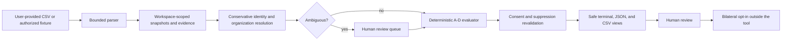

# Warm Path Audit

> **Release status:** [v0.1.0](https://github.com/joshgillespie-og-gtm/warm-path-audit/releases/tag/v0.1.0) is published on GitHub. See the [release notes](RELEASE-NOTES.md), [adversarial audit](AUDIT.md), and [release checklist](RELEASE-CHECKLIST.md).

> Find where an authorized professional network overlaps your ICP and target accounts, locally and explainably.

Warm Path Audit is a **local-first GTM network coverage auditor** for RevOps, Sales Ops, founders, and GTM engineers. It turns user-provided connection CSVs and explicit contributor consent into four evidence-backed queues. It is not a scraper, lead database, enrichment service, or outreach bot.

## See it in 40 seconds

[](docs/assets/walkthrough/warm-path-audit-walkthrough-silent-master.mp4)

[Watch the full-resolution silent walkthrough](docs/assets/walkthrough/warm-path-audit-walkthrough-silent-master.mp4) · No scraping · Local-first · Human review and bilateral consent

```text
WARM PATH AUDIT
Results are hypotheses for human review, not permission to contact.
Eligible: 4  A:1 B:1 C:1 D:1
Blocked: 2  Review-only: 0  Display-invalidated: 0

[A] potential direct icp lead | Alex Example | Lantern Labs | review priority 100
[B] review-pending coach/champion candidate | Blair Example | Northstar Systems | review priority 80
[C] broker path to target stakeholder | Casey Example | Northstar Systems | review priority 100
[D] review-pending coach/champion candidate | Devon Example | Northstar Systems | review priority 80
```

## Try it in five minutes

Requires Node.js 20+.

```sh
git clone https://github.com/joshgillespie-og-gtm/warm-path-audit.git
cd warm-path-audit
npm install
npm run check
npm run demo
```

The credential-free demo makes no network calls. It creates a private SQLite database and safe JSON/CSV reports under `/tmp/warm-path-audit-demo`. All names and domains are synthetic and reserved for examples.

- [15-minute walkthrough](docs/LOCAL-DEMO.md)
- [CLI reference](docs/CLI-REFERENCE.md)
- [Operator workflow](docs/OPERATOR-GUIDE.md)
- [CSV import and mapping](docs/CSV-IMPORT.md)

## The four finding classes

| Class | What it means                                                                                            | Hard boundary                                                                 |
| ----- | -------------------------------------------------------------------------------------------------------- | ----------------------------------------------------------------------------- |
| **A** | A configured direct connection at an ICP-fit organization with a deterministic stakeholder-persona match | Potential direct ICP lead, not permission to contact                          |
| **B** | A configured direct connection at a named target account whose persona is uncertain or does not match    | Review-pending coach/champion **candidate**, never proven influence or warmth |
| **C** | An eligible, consented broker edge to a deterministic stakeholder at a named target account              | A path hypothesis; an introduction still requires bilateral human opt-in      |
| **D** | An eligible, consented broker edge to another person at a named target account                           | Review-pending coach/champion **candidate**, never proven influence or warmth |

A may include ICP-fit organizations outside the named target list. B, C, and D are target-list-only. Hard evidence and policy gates always beat scores. Scores order human review; they do not measure relationship strength, influence, willingness, or contact permission.

[Read the exact matching semantics, scores, evidence, and reason codes.](docs/MATCHING-AND-EVIDENCE.md)

## What is implemented

- Strict TypeScript and Zod domain contracts
- Local SQLite storage with workspace isolation and restrictive file permissions
- Bounded, hostile-input-aware CSV ingestion with explicit mappings
- Conservative person and organization resolution with human review queues
- Deterministic A-D matching, canonical hashes, stable IDs, and append-only audit events
- Purpose-scoped contributor consent, expiry, withdrawal, suppressions, and deletion receipts
- Display-time consent and suppression revalidation
- Safe terminal, JSON, and CSV reports with spreadsheet and terminal-injection defenses
- Credential-free CLI and fixed-clock synthetic demo
- Vendor-neutral read-only CRM, email, and calendar adapter contracts
- A local fixture adapter for testing without credentials or network access

## What is not implemented

- No hosted UI or managed service
- No production Attio, HubSpot, Salesforce, email, or calendar connector
- No OAuth flow, provider SDK, HTTP client, or polling daemon
- No LinkedIn scraping, browser automation, private API use, or profile fetching
- No enrichment, guessed URLs, autonomous outreach, CRM writes, or silent contact creation
- No shared/global relationship graph
- No claim that a candidate is warm, influential, willing, or contactable

Attio, HubSpot, and generic CRM mappings are **illustrative only**. See [optional adapters](docs/OPTIONAL-ADAPTERS.md).

## How it works



Every result carries provenance and dependencies on contributors, consent records, source snapshots, evidence, and any applicable relationship edge. Identical inputs, policy, configuration, and clock produce the same run. Changed evidence or policy creates a distinct, traceable run.

- [Architecture and data lifecycle](docs/ARCHITECTURE.md)
- [Configuration](docs/CONFIGURATION.md)
- [Consent, review, and withdrawal](docs/CONSENT-AND-REVIEW.md)
- [Safe exports and redaction](docs/SAFE-EXPORTS.md)

## Safety model

The executable core has no network client or external mutation adapter. Imported URLs remain inert. Raw CSV retention is disabled after private staging. Ambiguous identifiers, names, shared addresses, Unicode confusables, subsidiaries, and organization aliases do not silently merge.

Default exports redact broker identities and exact edges. Reviewer output requires an explicit reviewer flag and still honors each contributor's disclosure permission. Reports omit contributor emails, raw rows, credentials, private source metadata, portable edge lists, and guessed relationship strength.

SQLite is plaintext. File modes reduce accidental exposure but are not encryption. Operators remain responsible for full-disk encryption, access control, backups, copied reports, retention, and applicable law and policy.

- [Privacy and security](docs/PRIVACY-SECURITY.md)
- [Threat model](THREAT-MODEL.md)
- [Enterprise pilot checklist](docs/ENTERPRISE-PILOT.md)
- [Security reporting](SECURITY.md)

## Operator commands

```text
init                    Create a private local workspace
contributor add         Register a contributor
consent add|withdraw    Add or withdraw purpose-scoped consent
import csv              Import a mapped, user-provided CSV
review list|decide      Resolve ambiguous person or organization claims
config validate         Validate engine configuration and policy
run                     Evaluate the workspace at an explicit clock
inspect ...             Inspect findings, blocks, evidence, consent, audit, or receipts
suppress add|remove     Apply or remove an operator suppression
export json|csv         Create a safe or authorized-reviewer report
demo                    Run the complete synthetic scenario
reset                   Guardedly delete a database within an allowed root
```

Run `node dist/cli/main.js help` after `npm run build`, or see the [CLI reference](docs/CLI-REFERENCE.md).

## Development

```sh
npm install
npm run check
npm run build
npm run demo
npm audit --audit-level=low
```

The validation suite covers formatting, linting, strict typechecking, tests, JSON Schemas, synthetic examples, formula injection variants, private-artifact checks, and network/process boundaries.

See [CONTRIBUTING.md](CONTRIBUTING.md), [GOVERNANCE.md](GOVERNANCE.md), [SUPPORT.md](SUPPORT.md), and the [roadmap](docs/ROADMAP.md).

## Independence and trademarks

Warm Path Audit is an independent open-source project and is not affiliated with, endorsed by, or sponsored by LinkedIn, Attio, HubSpot, Salesforce, or their affiliates. LinkedIn, Attio, HubSpot, Salesforce, and other product names are trademarks of their respective owners. References describe user-provided exports or illustrative mappings only.

The project does not contain Consigliere client data, its proprietary network graph, outcome history, or managed brokering process.

## Origin and license

The project was initiated by **Josh Gillespie**, a sales and GTM operator, to make network coverage review more evidence-based and consent-aware. Product claims should be judged from the code, tests, and documented boundaries, not biography.

Licensed under the [Apache License 2.0](LICENSE).
