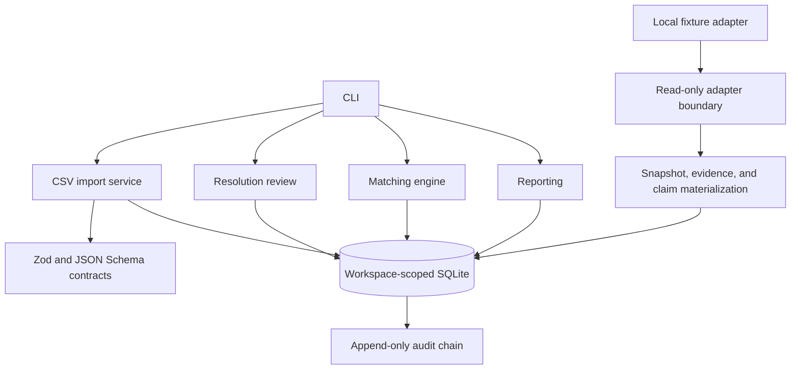
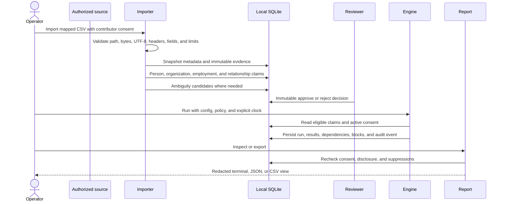

# Architecture and data lifecycle

Warm Path Audit is a local TypeScript application with a SQLite reference store. The CLI is an operator surface over strict runtime schemas and deterministic domain services.

## Components

The executable source does not include an HTTP client, provider SDK, outreach adapter, or CRM mutation path.

## Data lifecycle

## Trust boundaries

1. **Input boundary:** CSVs and adapter records are untrusted. Size, encoding, row, field, header, and schema checks fail closed.
2. **Identity boundary:** a claim is not global truth. Exact authorized identifiers can resolve only under conservative collision rules. Ambiguity requires review.
3. **Organization boundary:** aliases require a same-workspace persisted approval that binds source, canonical organization, kind, value, actor, reason, and time.
4. **Authorization boundary:** workspace purpose, policy effective time, contributor status, and every dependency consent must remain active and correctly scoped.
5. **Evaluation boundary:** hard gates run before scores. A score cannot revive stale, conflicted, suppressed, or unauthorized evidence.
6. **Display boundary:** persisted findings are revalidated before inspection or export. Withdrawal or suppression can hide an earlier finding without rewriting history.
7. **External-action boundary:** the project does not send messages, create contacts, mutate CRM stages, or execute introductions.

## Determinism and auditability

Stable IDs and hashes are derived from canonicalized, workspace-scoped inputs. An audit run binds input, configuration, policy, and explicit clock hashes. Repeating identical inputs is idempotent; material changes create a distinct run. Audit events are append-only and hash chained.

Determinism does not mean truth. It means the same declared evidence and rules produce the same inspectable conclusion.

## Persistence

The reference store is local SQLite. Database and generated report permissions are restricted where supported, but SQLite remains plaintext. There is no built-in key management, remote backup policy, high availability, or multi-process coordinator. See [production boundaries](PRODUCTION-BOUNDARIES.md).

## Domain references

- [`SPEC.md`](../SPEC.md): normative product behavior
- [`DECISIONS.md`](../DECISIONS.md): design decisions
- [`PRIVACY-BOUNDARIES.md`](../PRIVACY-BOUNDARIES.md): privacy boundaries
- [`THREAT-MODEL.md`](../THREAT-MODEL.md): detailed threats and controls
- [`schemas/`](../schemas): machine-readable contracts
